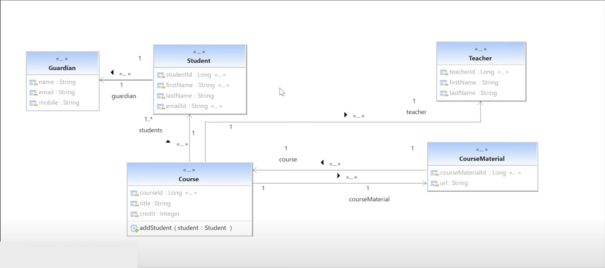

# SpringDataJPAAdmissionApp

- OneToOne: Course to CourseMaterial & vice-versa
- OneToMany: Teacher to Course
- ManyToOne: Course to Teacher
- ManyToMany: Student to Course

`Guardian embedded in Student`

